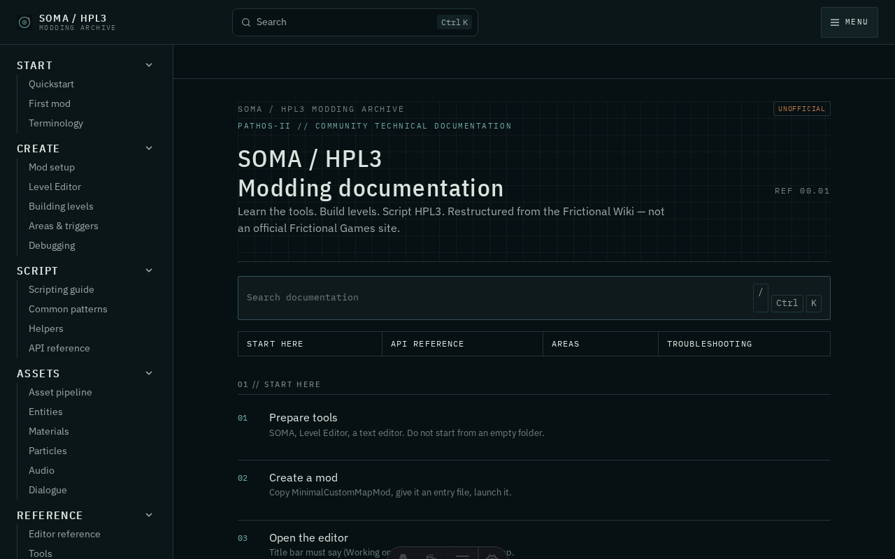

# SOMA / HPL3 Modding Docs

Unofficial community documentation for [SOMA](https://www.frictionalgames.com/) modding and the HPL3 editors that ship with the game.

This is **not** an official Frictional Games site. Source material is the [Frictional Wiki HPL3/SOMA tree](https://wiki.frictionalgames.com/page/HPL3/SOMA), restructured into a learning path, recipes, and a searchable API.



Live site: _set after GitHub Pages is enabled_.

## Local development

```bash
pnpm install
pnpm dev
```

```bash
pnpm build          # static site in dist/
pnpm sync:wiki      # fetch Frictional Wiki + regenerate generated pages
pnpm check          # internal links + link audit + typecheck
pnpm test
```

`pnpm sync:wiki` does **not** overwrite editorial pages listed in `scripts/wiki/transform.py` (`EDITOR_PAGES`).


